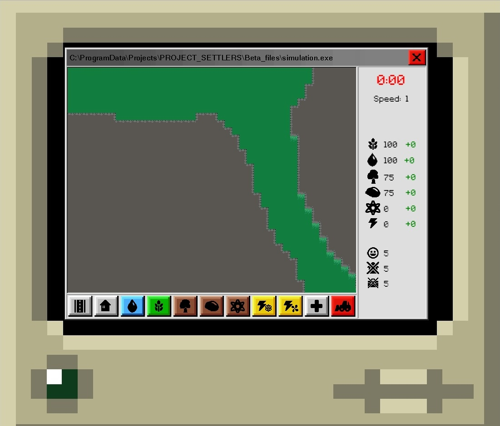
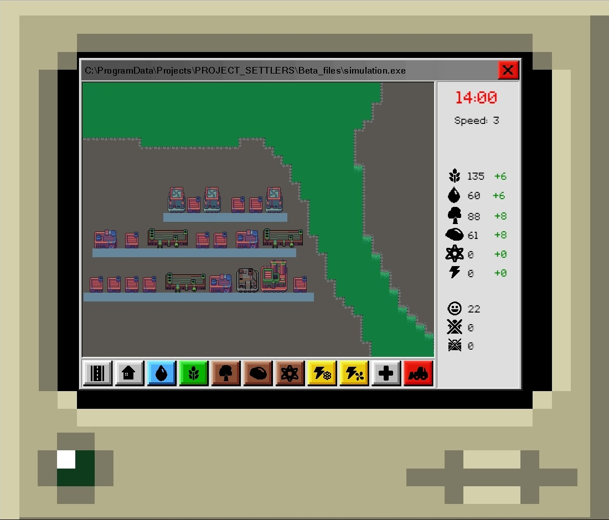
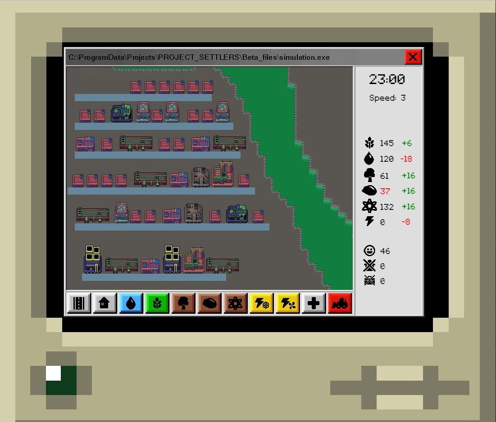
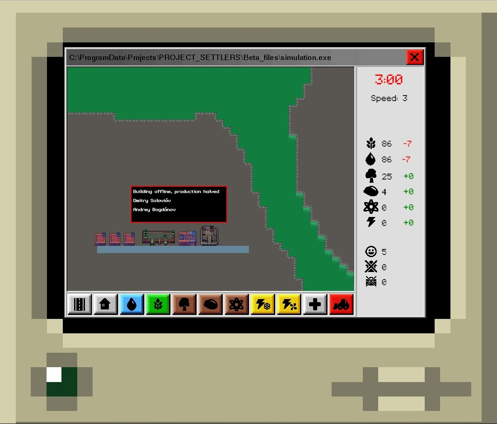

<h1 align="center"> Project Settlers </h1>
<h5 align="center">Published under the <a href="http://creativecommons.org/licenses/by-nc-sa/4.0/">Creative Commons Attribution-NonCommercial-ShareAlike</a> license. <h5>
  
<h1 align="center"><a href="https://javiarias.github.io/Project-Settlers/dist/">PLAY NOW!</a></h1>
  
## <a name="ENG"> :uk: </a>

To deal with a possible global nuclear catastrophe, the government has developed a simulator through which citizens of the future like you will be ready and able to cope with anything that slows down the resurgence of the human race.

Your objective will be to rebuild human society, starting from a small population and a limited amount of resources. You will have to keep your citizens healthy and happy by providing food and clean water, generating energy, monitoring radiation levels and keeping your city clean and safe. To do this, you will have access to blueprints of various facilities such as farms, decorative structures, water filters, roads, hospitals...

But beware! The world of the future is (EVEN) worse than today, and you may not have the same conveniences you have now. lack of water and food, no electricity to warm your homes or make work easy... Moreover, resources are not infinite: build more and more as your population grows exponentially.
**Project Settlers** is a real-time resource management game created by <a href="http://github.com/javiarias">Javier Arias</a> and <a href="http://github.com/IgnOry">Ignacio Ory</a>, two second-year students of Game Development at the Complutense University of Madrid (Universidad Complutense De Madrid"), as a four month proyect to learn about Javascript and designing games for the web.

The game counts with pixel-art graphics and an aesthetic inspired by old operating systems like Windows 98

Players are able to build and modify their own post-apocalyptic town from a top-down perspective, and will have to manage resources and space to help the town's citizens survive and prosper, providing theem with sustenance, jobs and places to live in.
\
\
\
As fans of games like The Settlers and Frostpunk, we wanted to make a game that would not only help us learn about a new programming language, but also be fun to design and create from the start. There were many bumps along the road (most of them thanks to Javascript), but we think we managed to make a good homage to the genre in the small time we had to develop this game. We only hope you, the player, will enjoy playing it just as much as we did making it.

## Features

- Top-down perspective.
- Real time game system.
- Retro graphics.
- A (simple) simulation of society
- **Playable online, NO downloads required!**
- Saves stored locally, so you only need to play from your browser of choice.

## List of assets used

- Webpage background (https://opengameart.org/content/communication-terminal-32x32)
- Tileset and buildings, with some editing (https://opengameart.org/content/colony-sim-extended-version)
- Tooltip code, also edited (https://github.com/netgfx/Phasetips)
- Main menu music (https://www.youtube.com/watch?v=gKUDbZisEZE&index=14&t=0s&list=LLrBPYrH1JFkaJgUtzk4922g)
- Main game music (https://www.youtube.com/watch?v=l554mG2laCM&feature=youtu.be)
- Font (https://www.dafont.com/enter-command.font)
- Button click (http://soundbible.com/772-Button.html)
- Everything else: made by us!

## Screenshots

